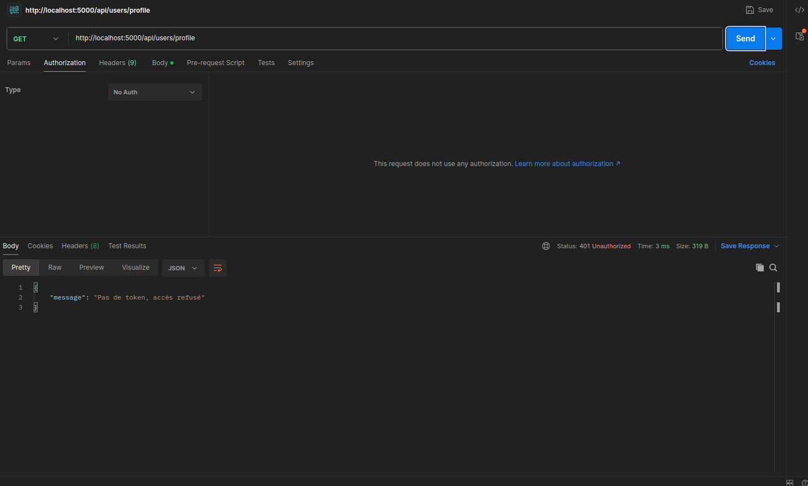
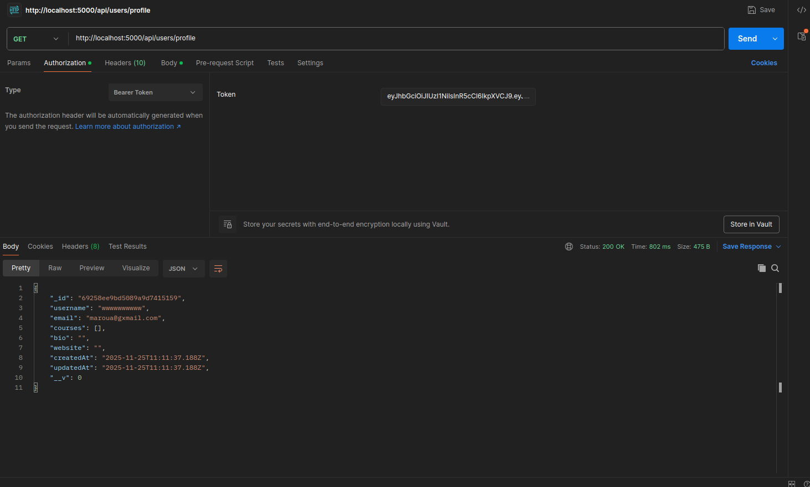

# EduPlatform – Projet MERN S9

Plateforme d'apprentissage en ligne construite avec la stack **MongoDB, Express, React et Node.js**. Le repository contient les deux parties Backend et Frontend, prêtes à être lancées localement puis poussées sur Git.

## Sommaire

1. [Stack & fonctionnalités](#stack--fonctionnalités)  
2. [Structure du dépôt](#structure-du-dépôt)  
3. [Prérequis](#prérequis)  
4. [Configuration des variables d'environnement](#configuration-des-variables-denvironnement)  
5. [Installation & démarrage](#installation--démarrage)  
6. [API principale](#api-principale)  
7. [Bonnes pratiques Git / Push](#bonnes-pratiques-git--push)  
8. [Scripts utiles](#scripts-utiles)

## Stack & fonctionnalités

- **Backend ( dossier `Back/` )**
  - Express 5 + Mongoose 9, authentification JWT, gestion des utilisateurs, cours et avis.
  - Middleware `protect` pour sécuriser les routes nécessitant un token.
  - Modèles MongoDB : `User`, `Course`, `Review`.

- **Frontend ( dossier `Front/Eduplatform_Front/` )**
  - React 19 + Vite + React Router 7.
  - Contexte d'authentification (`AuthProvider`, `useAuth`) + stockage du token dans `localStorage`.
  - Pages principales : Accueil, Liste des cours, Détails d'un cours, Profil, Login, Register.
  - Component `ProtectedRoute` pour verrouiller l'accès aux écrans privés.

## Structure du dépôt

```
MERN_S9/
├── Back/
│   ├── server.js
│   ├── routes/ (authRoutes, courseRoutes, userRoutes)
│   ├── models/ (User, Course, Review)
│   ├── middleware/authMiddleware.js
│   └── config/ *.js
└── Front/
    └── Eduplatform_Front/
        ├── src/
        │   ├── api/axios.js
        │   ├── context/ (AuthContext, authContext, useAuth)
        │   ├── components/ (Navbar, ProtectedRoute)
        │   └── pages/ (...)
        └── vite.config.js
```

## Prérequis

- Node.js ≥ 18
- npm ≥ 10
- Instance MongoDB accessible (locale ou Atlas)
- Git configuré (nom d’utilisateur & email)

## Configuration des variables d'environnement

Créer un fichier `Back/.env` :

```
PORT=5000
MONGO_URI=mongodb://localhost:27017/eduplatform
JWT_SECRET=remplacez-moi-par-une-valeur-secrète
```

> ⚠️ Ne pas committer `.env`. Ajoutez-le dans un `.gitignore` si nécessaire.

Le frontend utilise par défaut `http://localhost:5000/api` (voir `src/api/axios.js`). Adaptez l’URL si vous déployez ailleurs.

## Installation & démarrage

### 1. Backend

```bash
cd Back
npm install
npm start         # ou nodemon server.js si configuré
```

Le serveur Express se lance sur `http://localhost:5000` et se connecte à MongoDB en utilisant `MONGO_URI`.

### 2. Frontend

```bash
cd Front/Eduplatform_Front
npm install
npm run dev       # mode développement
npm run build     # production -> dist/
npm run preview   # prévisualiser le build
```

## API principale

| Méthode | Route | Description | Auth |
| --- | --- | --- | --- |
| POST | `/api/auth/register` | Inscription (username, email, password) | ❌ |
| POST | `/api/auth/login` | Connexion, retourne token JWT | ❌ |
| GET | `/api/auth/me` | Récupère l'utilisateur courant | ✅ |
| GET | `/api/courses` | Liste les cours | ❌ |
| GET | `/api/courses/:id` | Détail d'un cours | ❌ |
| POST | `/api/courses` | Création d'un cours | ❌ (*à sécuriser si besoin*) |
| POST | `/api/courses/:id/enroll` | Inscription à un cours | ✅ |
| GET | `/api/courses/:id/reviews` | Avis d'un cours | ❌ |
| POST | `/api/courses/:id/reviews` | Ajouter un avis | ✅ |
| GET | `/api/users/:id` | Profil utilisateur | ✅ |
| GET | `/api/users/:id/courses` | Cours suivis | ✅ |
| PUT | `/api/users/:id` | Mise à jour du profil (bio, site) | ✅ (propriétaire) |

## Bonnes pratiques Git / Push

1. **Vérifier l’état local**
   ```bash
   git status
   ```
2. **Ajouter les fichiers pertinents**
   ```bash
   git add README.md <autres fichiers>
   ```
3. **Valider avec un message clair**
   ```bash
   git commit -m "docs: ajoute README complet"
   ```
4. **Mettre à jour la branche distante**
   ```bash
   git push origin <branche>
   ```
5. **Avant de pousser**, pensez à :
   - Lancer `npm run lint`/`npm run build` côté front.
   - Vérifier que le backend démarre sans erreur (`node server.js`).
   - S’assurer que `.env` et `node_modules/` restent ignorés.

## Scripts utiles

| Dossier | Commande | Action |
| --- | --- | --- |
| `Back/` | `npm start` | Lance le serveur Express (via `node server.js`). |
| `Back/` | `nodemon server.js` | Relance automatiquement à chaque changement. |
| `Front/Eduplatform_Front/` | `npm run dev` | Serveur Vite + React Fast Refresh. |
| `Front/Eduplatform_Front/` | `npm run build` | Build production dans `dist/`. |
| `Front/Eduplatform_Front/` | `npm run preview` | Sert le build (sur `4173` par défaut). |

---

## Captures d'écran





---

Projet réalisé dans le cadre du module MERN S9. N’hésitez pas à enrichir ce README (tests, déploiement, captures) avant de pousser vos prochaines évolutions.

